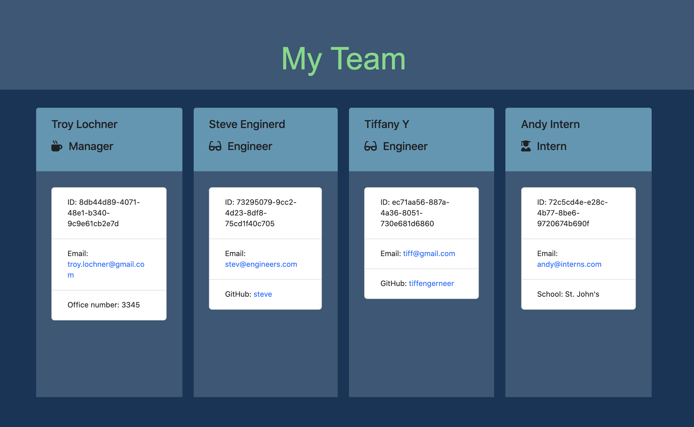

# Employee-Summary-Generator
# A node command line data entry tool.

# Usage :
To run this application ; 
1. Download this repository.
2. Run 'npm install' in the terminal to install  components. 
3. Run 'node app.js'
4. Follow the in-terminal prompts.
* Upon completion check the output/team.html file. This file will contain the output of the command line process. 

# Command Line Demo

# Sample Output HTML

